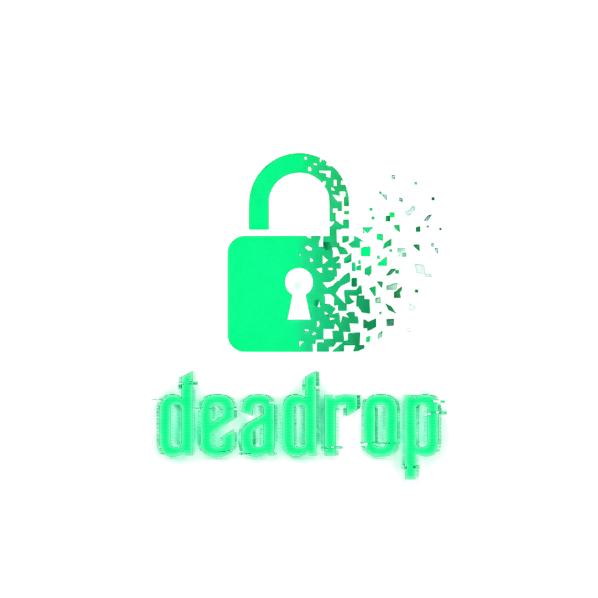

<p align="center">
  
</p>

<h1 align="center">deadrop</h1>

<p align="center">
  <b>Zero-knowledge file drops that self-destruct.</b><br/>
  One command. One link. Gone. Like it never happened.
</p>

<p align="center">
  <a href="https://crates.io/crates/deadrop"></a>
  <a href="https://github.com/Karmanya03/Deadrop/releases"></a>
  <a href="https://github.com/Karmanya03/Deadrop/blob/main/LICENSE"></a>
  
  
</p>

<p align="center">
  
  
  
  
  
</p>

---

## What is this?

Remember in spy movies when someone leaves a briefcase under a park bench, and someone else picks it up later? That's a dead drop.

This is that, but for files. Except the briefcase is encrypted with military-grade cryptography, the park bench self-destructs after pickup, nobody — not even the bench — knows what's inside, the bench can hide on the dark web, AND it now has a Cloudflare-powered tunnel so anyone on the internet can pick it up without you port-forwarding like it's 2003.

### How a drop works

```
  YOU                           YOUR MACHINE                         FRIEND
   |                                 |                                  |
   |   ded secret-plans.pdf          |                                  |
   |-------------------------------->|                                  |
   |                                 |                                  |
   |   1. Encrypt file (Rust)        |                                  |
   |   2. Key goes in URL #fragment  |                                  |
   |   3. Start server (Axum)        |                                  |
   |   4. Cloudflare tunnel opens    |                                  |
   |                                 |                                  |
   |   Share link (Signal/QR/etc)    |                                  |
   |------------------------------------------------------>            |
   |                                 |                                  |
   |                                 |  <--- Opens link in browser -----|
   |                                 |                                  |
   |                                 |  --- Try P2P WebSocket -------->|
   |                                 |  --- Fallback: HTTP download -->|
   |                                 |                                  |
   |                                 |       Browser extracts #key      |
   |                                 |       WASM decrypts locally      |
   |                                 |       File saves to device       |
   |                                 |                                  |
   |   BOOM. Self-destruct.          |                                  |
   |   Drop burned. Server dies.     |                                  |
   |   Tunnel closed.                |                                  |
   |                                 |                                  |
   V                                 V                                  V
   What file?                    What server?                    Got it, thanks.
```

## Features

### Core

| Feature | What it does |
|---|---|
| **End-to-end encrypted** | XChaCha20-Poly1305. The server is a blind courier — it couldn't read your file even if you asked nicely. |
| **Key in URL fragment** | The `#key` part never hits server logs, proxies, or HTTP headers. HTTP spec says so. Fight the spec, not us. |
| **Self-destruct** | Expire by time, download count, or both. This message will self-destruct in... you get it. |
| **Cloudflare tunnel** | Auto-creates a public `trycloudflare.com` URL. No port forwarding, no static IP, no DNS fiddling. Just works. |
| **WebSocket P2P transfer** | Browser downloads via WebSocket for faster, streamed delivery. If P2P fails, HTTP kicks in. You won't even notice. |
| **Works on phones** | Receiver needs a browser. That's it. No app, no account, no "sign up with your firstborn." |
| **Send folders** | Directories auto-pack to `.tar.gz`. Your entire `homework/` folder, encrypted. We won't ask what's in it. |
| **Multi-file drops** | `ded file1.txt file2.pdf photos/` — bundles everything into one encrypted drop. |
| **Stdin / clipboard** | `echo "secret" \| ded -` — pipe anything. Your terminal is the dead drop. |
| **Unlimited file size** | Streams from disk — your 50GB file won't eat your RAM for breakfast. |
| **Password protection** | Argon2id key derivation (64MB memory-hard, GPU-resistant). Receiver gets a password prompt in-browser, key derived client-side. Server never sees the password OR the key. |
| **QR code** | Because typing URLs is for people who still use fax machines. |
| **Receive mode** | `ded receive` — phone-to-PC uploads. Your phone becomes the dead drop. |
| **Tor hidden service** | `--tor` — spins up a `.onion` address. For when Cloudflare isn't paranoid enough. |
| **Single binary** | No runtime, no Docker, no config files. One executable. Runs anywhere Rust compiles (so, everywhere). |

### Security Hardening

The "we thought of that" section:

| Layer | What | Why you should care |
|---|---|---|
| **Encryption** | XChaCha20-Poly1305 (256-bit, AEAD) | Same cipher WireGuard and Cloudflare use. If it's broken, we all have bigger problems. |
| **Zero-knowledge** | Key lives in URL `#fragment` only | Server literally cannot learn the key. It's like asking a mailman to read a letter through a sealed envelope. Blindfolded. |
| **Browser hygiene** | Fragment auto-cleared from URL bar and history | `history.replaceState()` scrubs the `#key` the instant the page loads. |
| **Anti-forensics** | `mlock()` + `zeroize` + zero-write deletion | Key pinned in RAM (never swapped to disk), wiped on drop. Temp files overwritten with zeros before `rm`. CSI can go home. |
| **Access control** | IP pinning + rate limiting + 64-bit IDs | Download locked to first IP. 2 req/sec rate limit. ~2^64 possible drop IDs — you'll find Waldo first. |
| **Network** | Security headers (CSP, X-Frame-Options, no-referrer) | The whole paranoia buffet. All you can eat. |
| **Burn page** | "This drop was already downloaded and destroyed." | Late visitors get a polite middle finger. |
| **Auto-expire** | Tab open past expiry? Key nuked from JS memory. | The UI self-destructs too. Even your open tab isn't safe. |
| **Anonymity** | Tor hidden service (`.onion`) | When Cloudflare tunnels aren't enough, go full dark web. |
| **Constant-time 404s** | Random delay on not-found responses | Prevents timing attacks. Hackers hate this one weird trick. |

## Installation

### One-line install (Linux/macOS)

```bash
curl -fsSL https://raw.githubusercontent.com/Karmanya03/Deadrop/main/install.sh | bash
```

### One-line install (Windows PowerShell)

```powershell
irm https://raw.githubusercontent.com/Karmanya03/Deadrop/main/install.ps1 | iex
```

Both scripts auto-detect your platform, grab the right binary, rename it to `ded`, and add it to your PATH. Easier than ordering food online.

### Download a binary

Grab the latest from [**Releases**](https://github.com/Karmanya03/Deadrop/releases):

| Platform | Binary | Architecture |
|---|---|---|
| **Windows** | [`ded-windows-x86_64.exe`](https://github.com/Karmanya03/Deadrop/releases/latest/download/ded-windows-x86_64.exe) | x86_64 |
| **Linux** | [`ded-linux-x86_64`](https://github.com/Karmanya03/Deadrop/releases/latest/download/ded-linux-x86_64) | x86_64 (musl, static) |
| **Linux** | [`ded-linux-aarch64`](https://github.com/Karmanya03/Deadrop/releases/latest/download/ded-linux-aarch64) | ARM64 (Raspberry Pi, etc.) |
| **macOS** | [`ded-macos-x86_64`](https://github.com/Karmanya03/Deadrop/releases/latest/download/ded-macos-x86_64) | Intel |
| **macOS** | [`ded-macos-aarch64`](https://github.com/Karmanya03/Deadrop/releases/latest/download/ded-macos-aarch64) | Apple Silicon (M1/M2/M3/M4) |

**Quick install (Linux/macOS):**

```bash
# Linux x86_64
curl -L https://github.com/Karmanya03/Deadrop/releases/latest/download/ded-linux-x86_64 -o ded && chmod +x ded && sudo mv ded /usr/local/bin/

# macOS Apple Silicon
curl -L https://github.com/Karmanya03/Deadrop/releases/latest/download/ded-macos-aarch64 -o ded && chmod +x ded && sudo mv ded /usr/local/bin/
```

### Via cargo

```bash
cargo install deadrop
```

### Build from source

For the trust-no-one crowd (respect):

```bash
git clone https://github.com/Karmanya03/Deadrop.git
cd Deadrop
cargo build --release
# Binary at: target/release/ded
```

### Update

```bash
# Linux/macOS — same command, overwrites old binary
curl -fsSL https://raw.githubusercontent.com/Karmanya03/Deadrop/main/install.sh | bash

# Windows PowerShell
irm https://raw.githubusercontent.com/Karmanya03/Deadrop/main/install.ps1 | iex

# Via cargo
cargo install deadrop --force
```

### Uninstall

```bash
# Installed via script (Linux/macOS)
rm -f ~/.local/bin/ded

# Installed to /usr/local/bin/
sudo rm -f /usr/local/bin/ded

# Installed via script (Windows PowerShell)
Remove-Item "$env:USERPROFILE\.local\bin\ded.exe" -Force

# Installed via cargo
cargo uninstall deadrop
```

## Usage

### The basics

```bash
# Send a file — that's it, that's the whole tool
ded secret.pdf

# Send a folder — auto-archives to .tar.gz
ded ./tax-returns-2025/

# Send multiple files — bundles into one drop
ded passwords.csv backup.zip plans.pdf

# Pipe from stdin
echo "the password is swordfish" | ded -
cat ~/.ssh/id_rsa | ded -
```

### Receive mode

Your phone becomes the dead drop:

```bash
# Open upload page on your LAN — scan QR from phone
ded receive

# Save to a specific folder
ded receive -o ~/Downloads/

# Custom port, no QR
ded receive -p 9090 --no-qr
```

Scan the QR from your phone, pick a file, it gets encrypted in-browser, sent to your PC, decrypted, and saved. One upload, then the server self-destructs. Your phone just ghosted your PC (in a good way).

### Password mode

```bash
# Share a file with a password
ded secret.pdf --pw "correct-horse-battery-staple"
```

What happens under the hood:

1. Server encrypts the file with a key derived from your password via **Argon2id** (64MB, 3 iterations)
2. The URL contains the **salt** (not the key) — the link alone is useless
3. Receiver opens the link, sees a password prompt, enters the password
4. Browser derives the same key via **Argon2id in WASM** (same params, runs client-side)
5. File decrypts locally. Server never sees the password or the key. Ever.

Pro tip: Send the link over Slack, tell them the password on a phone call. Two channels, maximum paranoia, minimum effort.

### The spicy options

```bash
# Self-destruct after 1 download, expire in 10 minutes
ded evidence.zip -n 1 -e 10m

# 30-second self-destruct. Blink and it's gone.
ded confession.txt -e 30s

# Full Mission Impossible mode
ded plans.pdf -n 1 -e 30s --pw "this-message-will-self-destruct"

# Dark web drop — Tor hidden service
ded whistleblower-docs.pdf --tor

# Receive via Tor — maximum stealth
ded receive --tor -o ~/secrets/
```

### What you see

```
     ██████╗ ███████╗ █████╗ ██████╗ ██████╗  ██████╗ ██████╗
     ██╔══██╗██╔════╝██╔══██╗██╔══██╗██╔══██╗██╔═══██╗██╔══██╗
     ██║  ██║█████╗  ███████║██║  ██║██████╔╝██║   ██║██████╔╝
     ██║  ██║██╔══╝  ██╔══██║██║  ██║██╔══██╗██║   ██║██╔═══╝
     ██████╔╝███████╗██║  ██║██████╔╝██║  ██║╚██████╔╝██║
     ╚═════╝ ╚══════╝╚═╝  ╚═╝╚═════╝ ╚═╝  ╚═╝ ╚═════╝ ╚═╝

  ┌──────────────────────────────────────────────────┐
  │  URL  http://192.168.1.42:8080/d/a3f9c1b2#xK9m  │
  │                                                   │
  │  ├─ File       secret.pdf                         │
  │  ├─ Size       4.2 MB                             │
  │  ├─ Expires    10m                                │
  │  ├─ Downloads  1                                  │
  │  ├─ Password   yes (Argon2id)                     │
  │  └─ Crypto     XChaCha20-Poly1305                 │
  └──────────────────────────────────────────────────┘

  Tunnel: https://random-words.trycloudflare.com/d/a3f9c1b2#xK9m
  Tor:    http://abc...xyz.onion/d/a3f9c1b2#pw:...    (with --tor)

  █▀▀▀▀▀█ ▀▀▀█▄█ █▀▀▀▀▀█     <- QR code
  █ ███ █ █▀█ ▀▄  █ ███ █        scan with phone
  ...
```

## How It Works

### Send flow

Think of it like a relay race, except the baton is encrypted and the track self-destructs.

```
  SENDER                         SERVER (your PC)                     RECEIVER
    |                                  |                                  |
    |  1. Generate 256-bit key         |                                  |
    |     (or derive from password)    |                                  |
    |  2. Encrypt with XChaCha20       |                                  |
    |  3. Store ciphertext on disk --->|                                  |
    |  4. Key goes into URL #fragment  |                                  |
    |     (or salt, if --pw)           |                                  |
    |  5. Cloudflare tunnel opens ---->| (public URL, no port forwarding) |
    |                                  |                                  |
    |  6. Share link  -------------------------------------------->       |
    |     (Signal, QR, carrier pigeon) |                                  |
    |                                  |                                  |
    |                                  | <--- 7. Opens link --------------|
    |                                  |                                  |
    |                                  | --- 8a. WebSocket P2P -------->  |
    |                                  |     (fast, streamed)             |
    |                                  |                                  |
    |                                  | --- 8b. HTTP fallback -------->  |
    |                                  |     (if P2P fails, auto-switch)  |
    |                                  |                                  |
    |                                  |  9. Browser extracts #key        |
    |                                  |     (or prompts for password)    |
    |                                  | 10. WASM decrypts in browser     |
    |                                  | 11. File saves to device         |
    |                                  |                                  |
    |  SELF-DESTRUCT SEQUENCE:         |                                  |
    |  - Drop marked as burned         |                                  |
    |  - Ciphertext zero-wiped         |                                  |
    |  - Keys zeroized from RAM        |                                  |
    |  - Tunnel closed                 |                                  |
    |  - Server shuts down             |                                  |
    V                                  V                                  V
```

### Password flow (zero-knowledge)

The server is so clueless about your password, it makes Jon Snow look omniscient.

```
  SENDER                         SERVER                               RECEIVER
    |                                  |                                  |
    |  ded file --pw "hunter2"         |                                  |
    |                                  |                                  |
    |  1. Argon2id(password, salt)     |                                  |
    |     --> 256-bit key              |                                  |
    |  2. Encrypt file with key        |                                  |
    |  3. URL = .../d/id#pw:<salt>     |                                  |
    |     (salt in URL, NOT the key)   |                                  |
    |                                  |                                  |
    |  4. Share link  -------------------------------------------->       |
    |  5. Share password  ------ (different channel: call, SMS) -->       |
    |                                  |                                  |
    |                                  | <--- 6. Opens link --------------|
    |                                  | ---> 7. Serves download page --->|
    |                                  |                                  |
    |                                  |      8. Password prompt appears  |
    |                                  |      9. Types password           |
    |                                  |     10. WASM: Argon2id(pw,salt)  |
    |                                  |         --> derives same key     |
    |                                  |                                  |
    |                                  | <--11. Fetch encrypted blob -----|
    |                                  | -->12. Return ciphertext ------->|
    |                                  |                                  |
    |                                  |     13. WASM decrypts locally    |
    |                                  |     14. File downloads           |
    |                                  |                                  |
    |  Server never saw: password, key, or file contents. It died happy. |
    V                                  V                                  V
```

### Receive flow

```
  PC (you)                       SERVER (your PC)                     PHONE
    |                                  |                                  |
    |  ded receive                     |                                  |
    |  1. Generate key  -------------->|                                  |
    |  2. Key goes into QR code        |                                  |
    |                                  |                                  |
    |                                  | <--- 3. Scan QR, open page -----|
    |                                  |                                  |
    |                                  |      4. Pick file on phone       |
    |                                  |      5. WASM encrypts in-browser |
    |                                  |                                  |
    |                                  | <--- 6. Upload ciphertext ------|
    |                                  |                                  |
    |  7. Server decrypts  <-----------|                                  |
    |  8. Saves to disk                |                                  |
    |                                  |                                  |
    |  Done. Server self-destructs. Phone can leave now.                  |
    V                                  V                                  V
```

### Cloudflare tunnel flow

No more "open port 8080 on your router" nonsense. No more begging your ISP for a static IP.

```
  YOUR MACHINE                   CLOUDFLARE                          RECEIVER
    |                                  |                                  |
    |  Server starts on localhost      |                                  |
    |                                  |                                  |
    |  1. cloudflared creates tunnel ->|                                  |
    |     (outbound connection only)   |                                  |
    |                                  |                                  |
    |  2. Gets public URL:             |                                  |
    |     https://random.trycloudflare.com                                |
    |                                  |                                  |
    |                                  | <--- 3. Receiver opens URL ------|
    |                                  | ---> 4. Routes to your machine ->|
    |                                  |                                  |
    |  5. File transfer happens        |                                  |
    |     (P2P WebSocket or HTTP)      |                                  |
    |                                  |                                  |
    |  6. Drop self-destructs          |                                  |
    |  7. Tunnel closes                |                                  |
    V                                  V                                  V
```

Cloudflare only sees encrypted bytes. The `#key` fragment never leaves the browser. It's turtles (encryption) all the way down.

### Tor flow

For when you want to share files and also cosplay as a ghost:

```
  SENDER                         TOR NETWORK (3 relays)              RECEIVER
    |                                  |                                  |
    |  ded --tor secret.pdf            |                                  |
    |                                  |                                  |
    |  1. Spins up .onion service  --->|                                  |
    |     (takes ~30-60 seconds)       |                                  |
    |                                  |                                  |
    |  2. Share .onion URL  -----------|------------------------------>   |
    |                                  |                                  |
    |                                  | <--- 3. Opens in Tor Browser ---|
    |                                  | ---> 4. Encrypted bytes ------->|
    |                                  |                                  |
    |  No IP. No trace. No idea.       |      5. WASM decrypts locally   |
    V                                  V                                  V
```

### The download fallback system

Because the internet is held together with duct tape and prayers:

```
  Browser opens download link
    |
    +--> Try WebSocket P2P (fast, streamed, chunked)
    |      |
    |      +--> SUCCESS --> Decrypt with WASM --> Save file
    |      |
    |      +--> FAIL (timeout/error/blocked)
    |             |
    |             +--> Fallback to HTTP download (reliable, standard fetch)
    |                    |
    |                    +--> SUCCESS --> Decrypt with WASM --> Save file
    |                    |
    |                    +--> FAIL --> Show error message
    |
    +--> Either way, server self-destructs after successful download
```

The switch from P2P to HTTP is automatic and invisible. The receiver doesn't know or care. It just works, like magic, except it's actually just good error handling.

## Flags Cheat Sheet

### `ded [send]` — Send mode (default)

`send` is optional — `ded file.txt` and `ded send file.txt` are the same thing.

| Flag | Short | Default | Description |
|---|---|---|---|
| `<PATH>...` | — | — | File(s), folder(s), or `-` for stdin |
| `--port` | `-p` | `8080` | Port to listen on |
| `--expire` | `-e` | `1h` | Auto-expire duration (`30s`, `10m`, `1h`, `7d`) |
| `--downloads` | `-n` | `1` | Max downloads before self-destruct (0 = unlimited) |
| `--pw` | — | None | Password-protect drop (Argon2id, 64MB memory-hard) |
| `--bind` | `-b` | `0.0.0.0` | Bind address |
| `--no-qr` | — | `false` | Suppress QR code |
| `--tor` | — | `false` | Enable Tor hidden service |

### `ded receive` — Receive mode

| Flag | Short | Default | Description |
|---|---|---|---|
| `--port` | `-p` | `8080` | Port to listen on |
| `--output` | `-o` | `.` | Save received files here |
| `--bind` | `-b` | `0.0.0.0` | Bind address |
| `--no-qr` | — | `false` | Suppress QR code |
| `--tor` | — | `false` | Enable Tor hidden service |

## Demo Commands

Run one at a time — each starts a server. Ctrl+C to stop, then try the next.

| # | Feature | Command | What happens |
|---|---|---|---|
| 1 | Single file | `ded secret.pdf` | Encrypts, serves, browser decrypts, self-destructs |
| 2 | Folder | `ded ./my-folder/` | Archives to `.tar.gz`, encrypts, serves |
| 3 | Multi-file | `ded file1.txt file2.pdf pics/` | Bundles into one encrypted archive |
| 4 | Stdin pipe | `echo "swordfish" \| ded -` | Drops as `clipboard.txt` |
| 5 | Custom expiry | `ded file.txt -e 5m` | Dies after 5 minutes whether downloaded or not |
| 6 | Download limit | `ded file.txt -n 3` | Self-destructs after 3 downloads |
| 7 | No QR | `ded file.txt --no-qr` | URL only, no QR code clutter |
| 8 | Password | `ded file.txt --pw "hunter2"` | Receiver gets password prompt, Argon2id in-browser |
| 9 | Custom port | `ded file.txt -p 9090` | Listens on port 9090 |
| 10 | Full paranoia | `ded file.txt -n 1 -e 30s --pw "yolo"` | 1 download, 30s, password. Ethan Hunt approved. |
| 11 | Receive mode | `ded receive -o ~/Downloads/` | Upload page, phone sends file to PC |
| 12 | Receive custom | `ded receive -p 9999 --no-qr` | Custom port, no QR |
| 13 | Tor send | `ded secret.pdf --tor` | Generates `.onion` URL. Welcome to the dark side. |
| 14 | Tor receive | `ded receive --tor -o ~/secrets/` | Tor receive. Maximum stealth. |
| 15 | IP pinning test | `ded file.txt -n 2` | Download on PC, try on phone = 403. Get rekt. |
| 16 | Auto-expiry test | `ded file.txt -e 30s` | Wait 30s, open URL = "Drop not found" |

## Threat Model

### What we protect against

| Threat | How we handle it |
|---|---|
| Server operator reading files | Zero-knowledge. Key never reaches server. The server is basically a glorified USB stick that can't read. |
| Man-in-the-middle sniffing the key | Key lives in `#fragment`. Never transmitted over HTTP. It's in the URL but not *in* the request. HTTP is weird like that. |
| Intercepted URL (with `--pw`) | URL has salt, not key. Without password, it's a fancy paperweight. |
| Network eavesdropping | Application-layer encryption (XChaCha20-Poly1305). Even if someone's watching, they see gibberish. |
| Server logs leaking the key | Fragments aren't logged by any HTTP server or proxy. It's not a bug, it's a standard. |
| Brute force on encryption | 256-bit keys. The sun will burn out first. |
| GPU attacks on passwords | Argon2id with 64MB memory cost. Your RTX 4090 will need therapy. |
| Drop ID guessing | 16-char IDs (~2^64) + rate limiting + constant-time 404s. Good luck, speedrunner. |
| Shoulder surfing the URL bar | Fragment stripped on page load. Blink and it's gone. |
| Browser history forensics | `history.replaceState()` removes the `#key`. What key? |
| Key stuck in RAM | `zeroize` crate on Rust side, `key = null` on JS side. |
| Key swapped to disk | `mlock()` on Unix pins key to RAM. Swap file learns nothing. |
| Encrypted file recovery | Zero-overwrite before deletion. Forensic tools find zeros. |
| Clickjacking | `X-Frame-Options: DENY`. Try embedding us in an iframe. We dare you. |
| XSS injection | Content Security Policy locks scripts to `'self'` only. |
| Stale tab leaking key | Auto-expire nukes key from JS memory when drop expires. |
| IP tracking | `--tor` hides both sender and receiver behind `.onion`. |
| Cloudflare seeing your files | They see encrypted bytes. The `#fragment` never leaves your browser. |

### What we DON'T protect against

- Someone who has the full URL with the `#key` — that IS the key. Guard it like your Netflix password (the one you actually don't share).
- Malware on sender/receiver device (keyloggers, screen capture)
- Your friend screenshotting the file and posting it on Twitter
- Rubber hose cryptanalysis (look it up, it involves neither rubber nor hoses)
- Time travelers
- Your mom looking over your shoulder

## Technical Details

| Component | Choice | Why |
|---|---|---|
| Encryption | XChaCha20-Poly1305 | 256-bit, extended nonce, AEAD. If WireGuard trusts it, so can you. |
| KDF | Argon2id | Memory-hard, GPU-resistant. 64MB cost, 3 iterations. Won the Password Hashing Competition. |
| Browser KDF | Argon2id (WASM) | Same Rust `argon2` crate compiled to WASM. Same params, runs client-side. What runs on your server runs in their browser. |
| Chunk size | 64KB | Balances streaming performance vs. auth tag overhead. |
| Server | Axum (Rust) | Async, zero-copy, no garbage collector. Fast enough to make Go jealous. |
| Transport | WebSocket P2P + HTTP fallback | P2P for speed, HTTP for reliability. Belt and suspenders. |
| Tunnel | Cloudflare Quick Tunnel | Free, no account needed, auto-provisioned. Magic. |
| Rate limiter | tower_governor | Token bucket per IP. Brute-forcers hit a wall. |
| Browser crypto | WebAssembly | Same Rust code compiled to WASM. Near-native speed in the browser. |
| Nonce derivation | base XOR chunk_index | Per-chunk unique nonces without storing them. Clever? We think so. |
| Binary embedding | rust-embed | HTML, JS, WASM all baked into the single binary. No external files to lose. |
| Memory safety | mlock + zeroize | Key never hits swap, wiped from RAM on drop. |
| Anonymity | Tor hidden service | `.onion` address via local `tor` daemon. |
| Archive | tar + flate2 | Folder/multi-file bundling with gzip compression. |

## Memory Usage

| File Size | Server RAM | Browser RAM | Notes |
|---|---|---|---|
| 1 MB | ~5 MB | ~5 MB | Light as a feather |
| 100 MB | ~5 MB | ~200 MB | Still comfortable |
| 1 GB | ~5 MB | ~2 GB | Desktop territory |
| 10 GB | ~5 MB | Desktop only | Server doesn't care. It streams. |

The server uses constant memory regardless of file size. Streams encrypted chunks from disk. Your 50GB Linux ISO gets the same RAM treatment as a 1KB text file. The server is basically a goldfish — it forgets everything immediately.

## FAQ

**Q: Is this legal?**
A: It's a file sharing tool with encryption. Like Signal, or HTTPS, or putting a letter in an envelope. The tool is legal. What you put inside? That's between you and your lawyer.

**Q: Can I use this at work?**
A: Your IT department will either promote you or fire you. Possibly both. In that order.

**Q: Why not just use Google Drive?**
A: Google Drive knows your files, indexes them, probably shows them to an AI model for "training purposes." Deadrop doesn't know your files exist. Also, Google Drive doesn't self-destruct. Boring.

**Q: What happens if I lose the URL?**
A: The file is gone forever. That's not a bug, that's the whole personality of this tool.

**Q: Can the server see my files?**
A: No. The encryption key is in the URL fragment which never reaches the server. The server holds meaningless encrypted bytes and existential dread.

**Q: What about password-protected drops?**
A: Even better. The URL only has the salt. The server never sees the password or the key. The receiver's browser derives the key locally via Argon2id in WASM. The server is so uninvolved it might as well not exist.

**Q: What if someone intercepts my password drop URL?**
A: Without the password, the URL is a random string pointing to gibberish. They'd need to brute-force Argon2id at 64MB per guess. Their electricity bill would be more interesting than the result.

**Q: What about the Cloudflare tunnel? Can Cloudflare see my stuff?**
A: Cloudflare routes encrypted bytes. The decryption key is in the `#fragment` which never leaves the browser — not to Cloudflare, not to the server, not to anyone. Cloudflare is basically a bouncer who can't open the briefcase.

**Q: What if P2P WebSocket fails?**
A: HTTP fallback kicks in automatically. The switch is seamless. You won't even notice. We spent an unreasonable amount of time making sure of that.

**Q: What if someone else tries the link?**
A: IP pinning locks the download to the first device that connects. Everyone else gets a 403 and a lesson in being too slow.

**Q: Why does `--tor` take so long?**
A: Tor needs 30-60 seconds to generate a `.onion` address and build circuits through 3 relays. Anonymity is a marathon, not a sprint.

**Q: Can I send multiple files?**
A: `ded file1.txt file2.pdf folder/` — bundles everything into one encrypted `.tar.gz`. One link, many files, zero drama.

**Q: Why Rust?**
A: Fast, safe, single binary, zero runtime dependencies. Also because fighting the borrow checker at 3 AM builds character. And trust issues. Mostly trust issues.

## Contributing

PRs welcome. Here's the current state of things:

- [x] End-to-end encryption (XChaCha20-Poly1305)
- [x] QR code generation
- [x] Self-destruct by time & download count
- [x] IP pinning
- [x] Folder support (.tar.gz)
- [x] `ded receive` mode (phone to PC)
- [x] Multi-file drops
- [x] Stdin / clipboard mode
- [x] Tor hidden service
- [x] Password protection (Argon2id)
- [x] In-browser password prompt with client-side Argon2id
- [x] Cloudflare tunnel (auto-provisioned, zero config)
- [x] WebSocket P2P download with HTTP fallback
- [ ] Receiver-side streaming decryption for large files on mobile
- [ ] Web UI drag-and-drop improvements
- [ ] Resume interrupted downloads
- [ ] Multi-recipient drops (different keys per recipient)

## Star History

If you've read this far, you're contractually obligated to star the repo. It's in the fine print. Our lawyers (we don't have lawyers) will be in touch.

**[Star this repo](https://github.com/Karmanya03/Deadrop)** — every star makes the self-destruct mechanism 0.001% faster. (Citation needed.)

## License

MIT — do whatever you want. Just don't blame us when your dead drop works exactly as intended and the file vanishes forever. That's the point.

---

<p align="center">
  <sub>Built with Rust, Cloudflare tunnels, and an unreasonable amount of paranoia.</sub><br/>
  <sub>Remember: just because you're paranoid doesn't mean they're not after your files.</sub>
</p>
